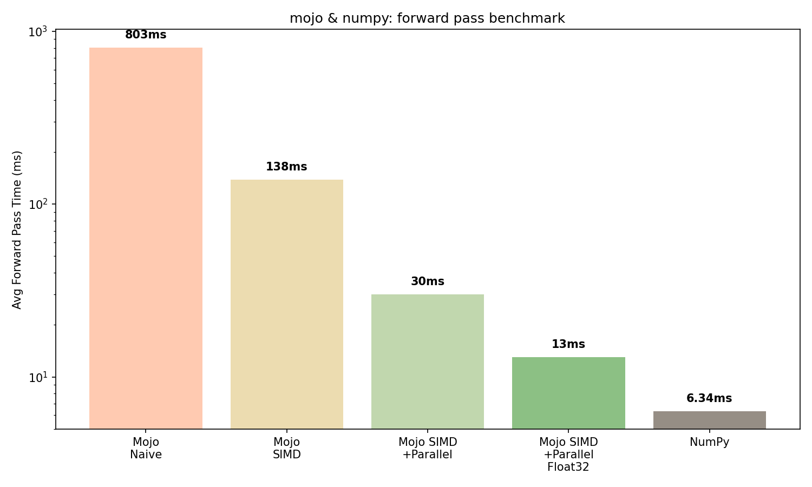

# Mojo & NumPy: MNIST Neural Network Benchmark

A from-scratch neural network trained on MNIST, implemented in both Python and Mojo, with a benchmarked comparison of forward pass performance.

## motivation/background
*a deconstruction experiment*

After learning about Modular's work, I wanted to explore Mojo's performance in ML workloads, especially with its lower-level hardware emphasis.

I rebuilt forward pass in Mojo to see what was actully happening behind-the-scenes inside NumPy's black box. Using SIMD vectorization and parallelization, I tried to understand where the performance comes from.

## network architecture
- **input layer:** 784 neurons (28x28 flattened MNIST images)
- **hidden layer:** 128 neurons (ReLU activation)
- **output layer:** 10 neurons (Softmax activation)
- trained from scratch using only NumPy — no ML frameworks
- **test accuracy:** ~97%

## results

| implementation              | avg forward pass (10k samples, 100 runs) | speedup vs naive |
|-----------------------------|------------------------------------------|------------------|
| Mojo naive                  | 803 ms                                   | baseline         |
| Mojo SIMD                   | 138 ms                                   | 5.8x             |
| Mojo SIMD + Parallel        | 30  ms                                   | 26x              |
| Mojo SIMD + Parallel Float32| 13 ms                                    | 62x              |
| NumPy (Python)              | 6.34 ms                                  | reference        |

**analysis:** each optimization step produced a meaningful & explainable speedup
- SIMD gave 5.8x, parallelization added another 4.6x, and switching from Float64 to Float32 doubled it
- remaining gap with numpy is likely due to BLAS (basic linear algebra subprograms) optimization rather than language limitation

## lessons

### SIMD (single instruction multiple data)
- modern CPUs can perform the same operation on multiple values simultaneously using special vector registers 
- on apple silicon, a single SIMD instruction can process 4 float32 values at once (one CPU cycle ends up doing the work for 4)
- numpy calls into BLAS libraries that use SIMD automatically
    - mojo exposes this directly through `SIMD[DType.float32, width]`, giving control over vectorization explicitly rather than offloading it to the complier and hoping it figures that out
- result is 5.8x faster speed over naive loops

### parallelization

### data types & register width

### memory access patterns and the BLAS gap
- 

## tech stack
- python3/numpy
- mojo 1.0.0b2
- mnist dataset via tensorflow
- benchmarked on apple macbook pro (apple silicon)

## Read More
*medium post coming soon*